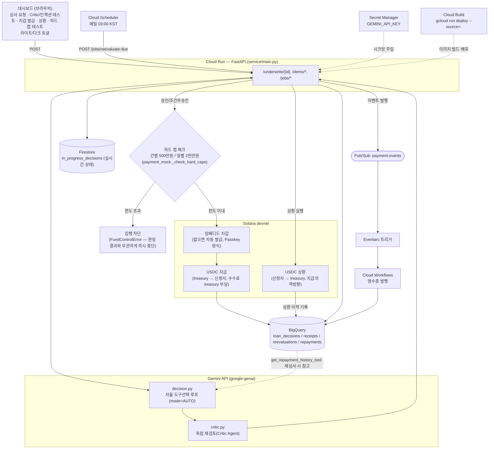

# CreditFlow AI Agent

소상공인 대출 사전심사 및 자동 소액대출 집행 에이전트 — Google Cloud AI × Solana Hackathon 제출작.

매출·거래 데이터(정량)와 사업자 설명 텍스트(정성)를 함께 분석해 대출 승인 여부를 자율적으로 판단하고, 승인/조건부승인 건은 검증 가능한 근거와 함께 Solana devnet으로 소액대출을 즉시 자동 집행한다. 실제 금융 서비스가 아닌, Kaggle 공개 데이터와 devnet(테스트넷)을 사용한 PoC다.

**라이브 데모**: https://creditflow-agent-46585987317.asia-northeast3.run.app

---

## 아키텍처 요약

```
신청자 ID 입력
   → Gemini 에이전트가 아래 도구 중 무엇을·몇 번·어떤 순서로 쓸지 스스로 판단 (automatic function calling, mode=AUTO)
       - 정형 데이터 조회 / XGBoost 부도확률·정량 등급 조회
       - (필요 시) SHAP 기여도 분석
       - (필요 시) 사업자 설명(정성 정보) 구조화 요약
       - (필요 시) RAG로 정책 조항 검색 — 질의문도 모델이 직접 작성
       - record_decision 호출로 최종 판정 제출 (정성 조정 규정 적용)
   → Critic Agent가 별도 Gemini 호출로 정책 조항 대비 1차 판정을 독립 재검토(반박/승인)
   → Solana devnet USDC 집행 + SPL Memo(근거 해시)
   → BigQuery 기록 (판정 근거 + Critic 검증 결과)
```

```
POST /underwrite/{applicant_id}  (Cloud Run, FastAPI)
   ├─ 판정 + devnet 집행 (동기) → BigQuery loan_decisions
   └─ Pub/Sub(payment-events) 발행
         → Eventarc 트리거 → Cloud Workflow → BigQuery receipts

Cloud Scheduler (매일 03:00 KST)
   └─ POST /jobs/reevaluate-due → 조건부승인 건 자동 조회(90일 경과 + 미재심사)
         → 합성 후속 텍스트가 준비된 건만 실제 재심사 처리 → BigQuery reevaluations
```

> "자동 조회"까지는 스케줄러가 매일 실제로 수행한다. "재심사 처리"는 PoC 범위상 후속 텍스트를 준비해둔 신청자 1명(61059)에 한해 검증 완료했다 — 상세는 아래 [PoC 범위 안내](#poc-범위-안내-알려진-제약) 참고.

### 서비스 흐름 다이어그램

(mermaid가 안 보이는 환경이라면 정적 이미지: [docs/architecture.png](docs/architecture.png))



**상환 루프**: `PoC 심사` → `지급(집행에 대한 검증 가능성 확보 — 온체인 메모)` → `상환(온체인, 지급의 역방향)` → `USDC 회수(treasury)` → `상환 이력 메모 기록(BigQuery)` → `재심사 입력으로 피드백(get_repayment_history_tool)`. 실제 원금/이자 상환 스케줄 계산은 PoC 범위 밖이며, devnet 왕복 증빙용 고정 소액으로 흐름만 시연한다.

**자금 통제**: 심사 판정(Decision/Critic)과 별개로, 온체인 집행 직전에 하드 캡을 독립적으로 강제한다 — 판정 로직이 어떤 이유로든(버그, 프롬프트 인젝션 등) 한도를 넘는 금액을 산정해도 이 계층에서 다시 한번 차단된다.

---

## 기술 스택

- **ML**: XGBoost (실제 서빙에 사용). LightGBM은 비교 모델로 학습만 했고 서빙에는 포함되지 않음. SHAP(`TreeExplainer`)으로 신청자 개별 단위 예측 설명력을 제공하고, scikit-learn `StratifiedKFold`로 5-fold 교차검증해 AUC 재현성을 확인했다(표준편차 0.001, `scripts/kfold_cv.py`).
- **에이전트 & LLM**: Gemini(`gemini-flash-lite-latest`) — `google-genai` SDK의 automatic function calling(mode=AUTO)으로 직접 구현. 도구 호출 여부·순서는 모델이 스스로 판단하며, 호출 로그(`tool_call_log`)로 그 과정을 그대로 노출한다. 1차 판정 이후 별도 Gemini 호출로 동작하는 Critic Agent(`scripts/agent/critic.py`)가 정책 문서 기준으로 판정을 독립 재검토(반박/승인, 강제 function calling mode=ANY)한다. 사업자 설명 텍스트 요약에는 `response_schema`(Pydantic) 기반 구조화 출력을 쓴다. 자체 구현 RAG(코사인 유사도 기반, 임베딩은 `gemini-embedding-001`).
- **온체인**: Solana devnet, `solana-py`/`solders`, Circle 공식 devnet USDC(SPL Token), SPL Memo(판정 근거 무결성 증명), `base58`. 지갑이 없는 신청자에게는 임베디드(커스터디) 지갑을 최초 승인 시 자동 발급하고, 상환(신청자 → treasury) 역방향 흐름과 건별/일별 하드캡(`FundControlError`, 판정 결과와 무관하게 즉시 차단)으로 실행을 통제한다.
- **백엔드**: FastAPI, uvicorn, python-multipart. 별도 프론트엔드 프레임워크 없이 서버 렌더링 대시보드 + 바닐라 JS 폴링(2.5초 간격)으로 실시간 상태를 반영한다.
- **인프라(GCP)**: Cloud Run, BigQuery, Pub/Sub, Eventarc, Cloud Workflows, Cloud Scheduler, Secret Manager, Cloud Build, Firestore(대시보드 "심사 중" 실시간 상태 공유, `scripts/agent/live_state.py`)
- **공통**: Python 3.12, pydantic, hashlib(sha256)

> 참고: Google ADK 기반 에이전트(`scripts/agent/adk_agent.py`)도 도구 자율 선택 구조를 프로토타이핑한 별도 스크립트로 남겨뒀다. 실제 배포 경로(`decision.py`)는 이와 동일한 자율 선택 원리를 `google-genai` SDK의 automatic function calling으로 직접 구현했다.

---

## 디렉토리 구조

```
scripts/
  preprocess.py          # Kaggle 원본 데이터 → 전처리 (train/val/test 분할)
  train_model.py         # XGBoost/LightGBM 학습, 임계값 산정
  visualize_results.py   # 성능지표 시각화 (models/figures/)
  devnet_transfer.py     # Solana devnet 지갑/USDC 전송 + Memo 저수준 함수
  payment_mock.py        # 판정 결과에 따른 devnet 집행 로직
  agent/
    decision.py          # 정량+정성 종합 최종 판정 — Gemini 자율 도구선택 루프 (핵심 로직)
    critic.py              # Critic Agent — 1차 판정을 정책 문서 기준으로 독립 재검토
    data_tools.py         # 정형 데이터 조회 + XGBoost 예측
    business_text.py      # 사업자 설명 요약 (Gemini)
    rag.py                 # 정책 문서 RAG
    reevaluation.py        # 조건부승인 건 자동 재심사
    bigquery_logger.py     # BigQuery 기록/조회
    verify_memo.py         # 온체인 메모 위변조 검증
    policy_docs/loan_policy.md  # 대출 정책 문서 (RAG 소스)
service/
  main.py                # FastAPI 서비스 (Cloud Run에 배포)
workflows/
  payment_receipt_workflow.yaml  # Cloud Workflow 정의
models/                  # 학습된 모델, 임계값, 성능지표, 차트
```

---

## 실행 방법

### 1. 사전 준비

- Python 3.12
- Google Cloud 프로젝트 (Vertex AI/AI Studio, BigQuery, Cloud Run, Pub/Sub, Eventarc, Workflows, Secret Manager, Cloud Scheduler API 활성화)
- [Google AI Studio](https://aistudio.google.com/)에서 발급한 Gemini API 키 (별도 GCP 결제 계정 불필요)
- `gcloud` CLI (배포 시에만 필요)
- Kaggle **"Loan Prediction Based on Customer Behavior"** 데이터셋의 `Training Data.csv`, `Test Data.csv`, `Sample Prediction Dataset.csv`를 프로젝트 루트에 배치 (용량 문제로 저장소에는 포함하지 않음)

### 2. 설치

```bash
pip install -r service/requirements.txt
```

### 3. 환경 변수

프로젝트 루트에 `.env` 파일 생성:

```
GEMINI_API_KEY=your-ai-studio-api-key
```

`scripts/agent/bigquery_logger.py`의 `PROJECT_ID`를 본인 GCP 프로젝트 ID로 변경한다 (기본값: `gc-hackathon-504210`).

### 4. 모델 학습

```bash
python scripts/preprocess.py
python scripts/train_model.py
python scripts/visualize_results.py   # 선택, models/figures/ 에 차트 생성
```

### 5. devnet 지갑 준비

```bash
python scripts/devnet_transfer.py
```

최초 실행 시 `onchain/devnet_keys/`에 지갑을 생성한다. 콘솔에 출력되는 주소로 [faucet.solana.com](https://faucet.solana.com)(SOL)과 [faucet.circle.com](https://faucet.circle.com)(devnet USDC)에서 수동으로 테스트 토큰을 받아야 한다 (reCAPTCHA로 인해 자동화 불가).

### 6. 로컬에서 판정 실행

```bash
cd scripts
python -c "from agent.decision import make_final_decision; print(make_final_decision(10736))"
```

### 7. BigQuery 준비

```bash
python -c "from scripts.agent import bigquery_logger; bigquery_logger.ensure_table(); bigquery_logger.ensure_receipts_table(); bigquery_logger.ensure_reeval_table()"
```

### 8. Cloud Run 배포 (선택)

```bash
gcloud run deploy creditflow-agent \
  --source=. \
  --region=asia-northeast3 \
  --allow-unauthenticated \
  --set-secrets=GEMINI_API_KEY=gemini-api-key:latest \
  --min-instances=1
```

배포 전 `gcloud secrets create gemini-api-key --data-file=-`로 Secret Manager에 키를 등록해야 한다. Pub/Sub 토픽, Eventarc 트리거, Cloud Workflow, Cloud Scheduler 잡은 각 서비스의 표준 `gcloud` 명령으로 별도 생성한다 (`workflows/payment_receipt_workflow.yaml` 참고).

`--min-instances=1`은 콜드 스타트(트래픽이 없어 인스턴스가 0개로 내려갔다가, 다음 요청에서 컨테이너를 새로 기동하며 생기는 지연)를 막기 위한 설정이다 — 라이브 데모 중 첫 요청이 느리게 응답하는 것을 방지한다. 인스턴스 1개를 상시 유지하는 비용이 들지만(기본 CPU 스로틀링 모드에서는 대기 중 메모리 비용만 과금되어 하루 수백 원 수준), 그만한 값어치가 있다고 판단해 적용했다. 트래픽이 정말 없을 때는 `--min-instances=0`으로 되돌려도 된다.

---

## API

| 엔드포인트 | 설명 |
|---|---|
| `GET /health` | 헬스 체크 |
| `GET /` | 심사 대시보드 (읽기 전용) |
| `POST /underwrite/{applicant_id}` | 판정 + devnet 집행 실행 |
| `POST /jobs/reevaluate-due?min_days=90` | 조건부승인 건 자동 조회 (Cloud Scheduler가 호출) — 실제 재심사 처리는 61059번 한정, [PoC 범위 안내](#poc-범위-안내-알려진-제약) 참고 |
| `POST /decisions/delete` | 대시보드에서 특정 기록 삭제 (관리용, 보호키 필요) |

예시:
```bash
curl -s -X POST -d "{}" https://creditflow-agent-46585987317.asia-northeast3.run.app/underwrite/10736
```

---

## 성능지표

- Test AUC: **0.7883** (XGBoost)
- 등급별 실제 부도율(test): 승인 7.66% · 조건부승인 28.09% · 거절 43.66% (단조 증가 확인)
- 상세 수치와 차트: `models/metrics_report.json`, `models/figures/`

---

## PoC 범위 안내 (알려진 제약)

- 정적 Kaggle 데이터셋 기반 PoC로, 사업자 설명 텍스트는 자체 작성한 합성(synthetic) 텍스트다.
- 조건부승인 건의 "3개월 후 자동 재심사"는 스케줄러/쿼리 구조 자체는 범용이지만, 실제 종단간 검증은 합성 후속 텍스트를 준비한 신청자 1명(61059)에 대해서만 완료했다.
- Google ADK 기반 에이전트(`adk_agent.py`)는 도구 자율 선택 구조를 검증한 프로토타입으로 남겨뒀다 — 최종 배포 경로는 동일한 원리를 `google-genai` SDK로 직접 구현했다.
- Critic Agent는 1차 판정에 대해 승인/반박만 판단하며, 반박 시 자동으로 재판정을 트리거하는 피드백 루프는 아직 구현하지 않았다 (반박 결과는 대시보드/리포트에 노출되어 사람이 검토할 수 있다).
- devnet/테스트 데이터를 사용하는 PoC이며, 실제 금융 서비스가 아니다.
