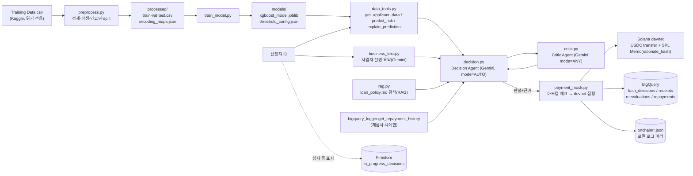

# 데이터 계보 (Data Lineage)

원본 Kaggle 데이터가 어떤 단계를 거쳐 모델 입력이 되고, 심사 판정이 어떤 근거들을 조합해
만들어지며, 그 결과가 어느 저장소들에 어떤 형태로 남는지를 추적하는 문서. 각 단계에서
등장하는 필드의 상세 정의는 [data_dictionary.md](data_dictionary.md)를 참고.

목적: (1) 판정 결과 하나를 거슬러 올라가 "이 숫자가 어디서 왔는가"를 재구성할 수 있게 하고,
(2) 원본 데이터 변경이나 파이프라인 수정이 어디까지 영향을 미치는지 파악하기 위함.

---

## 1. 전체 흐름 개요

정적 이미지가 필요하면 이 mermaid 블록을 `docs/architecture.mmd`와 같은 방식으로 렌더링해 사용한다
(전체 서비스 아키텍처는 [architecture.mmd](architecture.mmd)/[architecture.png](architecture.png) 참고 —
이 문서는 시스템 구조가 아니라 **데이터의 변환·이동**에 초점을 맞춘다).

---

## 2. 단계별 상세

### 2.1 원본 → 전처리 (`scripts/preprocess.py`)

| 단계 | 입력 | 처리 | 출력 |
|---|---|---|---|
| 로드 | `Training Data.csv` | 읽기 전용, 수정 없음 | `DataFrame` |
| 정제 | `CITY`/`STATE`/`Profession` | 위키백과 각주 잔재 제거(`[10]` 등), 공백↔언더스코어 통일 | 정제된 범주형 |
| 컬럼명 표준화 | `Id`/`Income`/... | `RENAME_MAP`으로 업무 맥락에 맞는 이름으로 변경 (예: `Income`→`annual_revenue_krw`) | 표준화된 컬럼명 |
| 피처 엔지니어링 | 정제된 원본 | `is_married`, `job_stability_ratio`, `income_log` 등 파생 + `revenue_volatility_synth`/`debt_to_income_synth` 합성(id 시드 고정 난수) | 18개 피처 |
| 분할 | 전체 데이터 | `default_risk_label` 기준 stratified split (seed=42), 70/15/15 | `train`/`val`/`test` |
| 인코딩 | 분할된 데이터 | `industry_sector`/`biz_city`/`biz_region`은 **train에서만** target encoding 학습 후 val/test에 적용(리키지 방지); `biz_premise_ownership`은 원-핫 | `processed/*.csv`, `encoding_maps.json` |

**리키지 방지 지점**: target encoding 매핑은 `train_df`로만 `fit_target_encoding`을 호출하고,
val/test에는 `apply_target_encoding`으로 그 매핑을 그대로 적용한다(`preprocess.py:148-152`).
train에 없던 카테고리는 `global_mean`으로 대체된다.

### 2.2 전처리 → 모델 (`scripts/train_model.py`, `scripts/kfold_cv.py`)

- `processed/train.csv`로 XGBoost/LightGBM을 학습, `processed/val.csv`로 임계값(`t_approve`, `t_reject`)을 산정한다.
- `scripts/kfold_cv.py`가 `StratifiedKFold`(5-fold)로 AUC 재현성을 별도 검증(`models/kfold_cv_report.json`).
- 최종 산출물: `models/xgboost_model.joblib`, `models/threshold_config.json`, `models/metrics_report.json`.
- 서빙 시점에는 `data_tools._load_state()`가 `train`+`val`+`test`를 합쳐(`_all_rows`) `applicant_id`로 행을 조회한다 —
  즉 런타임 조회는 원본 CSV가 아니라 **전처리 완료된 `processed/*.csv`**를 소스로 쓴다.

### 2.3 모델 → 1차 정량 판정 (`scripts/agent/data_tools.py`)

| 함수 | 입력 | 출력 | 소비처 |
|---|---|---|---|
| `get_applicant_data` | `applicant_id` | 피처 값 + 실제 라벨(있으면) | Decision Agent, BigQuery 대출금 계산 |
| `predict_risk` | `applicant_id` | `default_probability`, `quant_tier`(approve/conditional/reject) | Decision Agent, Critic Agent |
| `explain_prediction` | `applicant_id` | SHAP 상위 기여 피처 (log-odds 단위) | Decision Agent 판정 근거, 대시보드 |

### 2.4 정성 정보 + 정책 근거 수집

- `business_text.py`: 사업자 설명 텍스트(PoC에서는 합성 텍스트, `SAMPLE_BUSINESS_DESCRIPTIONS`) →
  Gemini 구조화 출력(`response_schema`)으로 요약.
- `rag.py`: `loan_policy.md`를 `## ` 섹션 단위로 청크 분할 → `gemini-embedding-001`로 임베딩(로컬
  `.embedding_cache.json`에 캐싱, 문서 내용이 바뀌면 자동 재임베딩) → 질의(모델이 직접 작성)와
  코사인 유사도로 top-k 조항 검색.
- `bigquery_logger.get_repayment_history`: 재심사 시에만 `repayments` 테이블을 조회해 과거 상환
  이력을 Decision Agent에 공급.

### 2.5 판정 (`scripts/agent/decision.py`, `critic.py`)

1. Decision Agent가 위 도구들을 자율적으로(mode=AUTO) 호출해 정량 등급 + 정성 요약 + 정책 조항을
   종합, `record_decision_tool`로 `final_decision`/`adjustment_applied`/`adjustment_direction`/
   `decision_reasoning`을 제출한다. 모델이 필수 도구 호출을 건너뛴 극단적 경우에만
   `source="fallback"`으로 안전장치가 보강한다(`tool_call_log`에 그대로 표시되어 사후 추적 가능).
2. 승인/조건부승인 시 `approved_amount_krw`는 `annual_revenue_krw`(원본 → 전처리 파생) 기준으로
   서버가 계산(`LOAN_RATE=5%`, `LOAN_CAP_KRW=5,000,000`) — 모델이 임의 금액을 만들어낼 수 없다.
3. Critic Agent가 별도 Gemini 호출(mode=ANY, 강제 function calling)로 1차 판정을 재검토해
   `critic_verdict`/`critic_reasoning`을 반환.
4. 이 시점까지의 모든 근거(`quant`, `explanation`, `biz_summary`, `policy_hits`, `tool_call_log`,
   `critic_result`)가 `FinalDecisionResult`(메모리 내 dataclass)로 합쳐진다.

### 2.6 판정 → 온체인 집행 → 영구 기록 (`payment_mock.py`, `devnet_transfer.py`, `bigquery_logger.py`)

1. **하드캡 체크** (`_check_hard_caps`): 판정 로직과 독립적으로, 지갑 조회/발급보다 먼저 건별
   500만원·일별 2,000만원 한도를 강제. 초과 시 `FundControlError`로 즉시 중단 — 이 시점 이후의
   어떤 데이터도 생성되지 않는다(지갑 파일도 만들어지지 않음).
2. **근거 해시**: `_rationale_hash(rationale)` = `sha256(decision_reasoning)`.
3. **온체인 집행**: `devnet_transfer.send_devnet_usdc_payment`가 Solana devnet에서 USDC를 송금하며,
   `_build_memo`가 만든 `FundBridge|applicant=...|decision=...|sha256=<rationale_hash>` 문자열을
   SPL Memo로 트랜잭션에 원자적으로 함께 기록한다 → `tx_signature` 생성.
4. **영구 기록**: 같은 레코드가 두 곳에 동시에 남는다 — BigQuery `loan_decisions`(원장)과
   `onchain/payments_log.json`(로컬 미러, 발표/디버깅용). 거절 건은 지갑 조회·발급·송금 자체를
   하지 않고 판정 근거만 기록한다.
5. **무결성 검증 경로**: 제3자는 `rationale`(BigQuery) → `sha256` 재계산 → 온체인 Memo의 해시와
   대조해 판정 근거가 사후에 변경되지 않았음을 검증할 수 있다(`scripts/agent/verify_memo.py`).

### 2.7 조건부승인 → 재심사 (`scripts/agent/reevaluation.py`, Cloud Scheduler)

1. Cloud Scheduler(매일 03:00 KST)가 `POST /jobs/reevaluate-due`를 호출.
2. `bigquery_logger.find_due_conditionals`가 `loan_decisions`에서 `decision='conditional'`,
   `status='EXECUTED'`, 90일 경과, 아직 `reevaluations`에 없는 건을 조회(범용 쿼리 — 특정
   신청자에 종속되지 않음).
3. 실제 재심사 처리(합성 후속 텍스트 준비된 신청자 61059 한정, PoC 범위)는 `make_final_decision`을
   `is_reevaluation=True`로 다시 호출 — 이때 `get_repayment_history_tool`이 `repayments` 테이블을
   추가로 참고한다.
4. 결과는 `reevaluations` 테이블에 적재되고, 승인 상향 시 잔여 50%가 동일한 하드캡 검증을 거쳐
   추가 집행된다.

### 2.8 상환 (`payment_mock.collect_repayment`)

지급의 역방향(신청자 → treasury)으로, 동일한 해시/Memo 방식을 적용해 `repayments` 테이블과
`onchain/repayments_log.json`에 기록된다. 재심사 시 `get_repayment_history_tool`이 이 데이터를
피드백으로 참고한다(2.7 참고) — 즉 상환 기록이 다음 심사 판정에 입력으로 재유입되는 유일한 루프.

### 2.9 부가 상태 (Firestore `in_progress_decisions`)

위 어떤 영구 기록에도 속하지 않는 순수 UX 상태. 판정 흐름의 입력이나 출력이 아니며, 실패해도
심사/집행 자체를 막지 않는다(2.5 절 데이터 계보에는 참여하지 않음).

---

## 3. 리키지·재현성 관련 주의사항

- **Train/val/test 경계**: target encoding, 임계값 산정 모두 train만 사용해 학습하고 val/test에는
  적용만 한다 — 이 경계를 넘어서 재학습하면 성능 지표(AUC 0.7883 등)가 낙관적으로 왜곡된다.
- **합성 피처**: `revenue_volatility_synth`/`debt_to_income_synth`는 id 기반 시드 고정 난수라 재실행해도
  동일한 값이 나오지만(재현 가능), 실제 매출 변동성/부채비율을 반영하지 않는다 — 실 서비스
  전환 시 이 두 필드의 데이터 원천을 계좌/매출 API로 교체하는 것이 최우선 작업이다.
- **재심사 표본**: 2.7의 종단 간 검증은 신청자 61059 1명 한정 — 재심사 로직 자체(쿼리·스케줄러)는
  범용이지만, 실제로 흘러간 데이터로 검증된 표본은 1건뿐이라는 점을 계보 해석 시 감안해야 한다.
